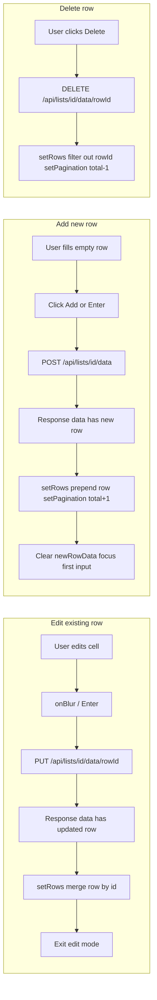

# ListDataTable Async Editing and Add-Row UX Plan (Revised)

## Scope

Target: [components/lists/ListDataTable.tsx](components/lists/ListDataTable.tsx) — the inline-editable table on the list detail page (`/lists/[id]`) where users edit rows and add new rows.

---

## Current Behavior (Problems)

### 1. Full refetch causes flicker

- After every **row edit** (onBlur), **row add**, and **row delete**, `fetchData()` is called
- `fetchData()` sets `loading=true` → full-page spinner replaces the table
- User loses context and sees a jarring reload

### 2. Tab-to-add inconsistency

- **Input/select** (last column): Tab triggers `handleTabFromLastColumn` → auto-saves if validation passes
- **Textarea** (last column): No Tab handler → Tab moves focus to Add button (or next element)
- **Checkbox** (last column): No Tab handler
- Result: "Sometimes it adds when tabbing, sometimes requires click" — depends on which field type is last and validation state

### 3. API response ignored

- PUT and POST APIs return the updated/created row in `response.data`
- Response is ignored; `fetchData()` refetches everything instead of merging the returned row into local state

---

## Proposed Changes

### Phase 1: Server-response updates (no full refresh)

**1.1 Row edit (handleSaveRow)**

- After successful PUT: parse `response.json()`, use `response.data` (the updated row)
- Merge into local state: `setRows(prev => prev.map(r => r.id === rowId ? { ...response.data, rowData: response.data.rowData } : r))`
- Ensure row shape: `{ id, rowData, createdAt, updatedAt }` (Prisma returns extra fields; use what the component needs)
- Do **not** call `fetchData()`
- Do **not** set `loading=true` for save operations
- Keep `setEditingCell(null)` and `setEditingData({})` to exit edit mode

**1.2 Row add (handleSaveNewRow)**

- After successful POST: parse `response.json()`, use `response.data` (the new row)
- **Prepend** to local state: `setRows(prev => [response.data, ...prev])` — new rows typically belong at top when sorted by `createdAt desc`
- Update pagination: `setPagination(prev => ({ ...prev, total: prev.total + 1 }))`
- Do **not** call `fetchData()`
- Clear `newRowData` and `newRowErrors` as today
- Focus first empty-row input after a short delay (keep current behavior)

**1.3 Row delete (handleDelete)**

- After successful DELETE: remove row from local state by id
- `setRows(prev => prev.filter(r => r.id !== rowId))`
- Update pagination: `setPagination(prev => ({ ...prev, total: Math.max(0, prev.total - 1) }))`
- Do **not** call `fetchData()`

**1.4 Loading state**

- Use `loading` only for initial load and pagination/filter/sort changes (when `fetchData` runs)
- Do not set `loading` for save/add/delete operations

---

### Phase 2: Manual add only (remove Tab-to-add)

**2.1 Remove `handleTabFromLastColumn`**

- Delete the function entirely
- Remove all `onKeyDown` handlers that call it (input and select in `renderEmptyRowCell`)

**2.2 Consistent Tab behavior**

- Tab always moves focus; never auto-saves
- Add row only via explicit **Add** button click (or Enter when Add button is focused)
- Ensures predictable UX: "fill fields → Tab to Add button → Enter or click"

**2.3 Add button visibility**

- Keep current logic: Add button visible when `checkRequiredFieldsComplete()` is true
- User can Tab to Add when ready, then press Enter or click

---

### Phase 3: Optional UX polish (lower priority)

- **Per-cell saving indicator**: Show a small spinner in the cell/row while the save request is in flight (since we wait for the server response before updating)
- **Toast on success/error**: Replace or supplement `setError()` with a toast so errors don't persist in the card
- **Tab between cells when editing**: Allow Tab/Shift+Tab to move between editable cells within a row before saving (multi-cell edit mode)

---

## Data Flow (After Changes)

---

## API Response Shape

| Endpoint                           | Response                 | Use                                                  |
| ---------------------------------- | ------------------------ | ---------------------------------------------------- |
| PUT `/api/lists/[id]/data/[rowId]` | `{ message, data: row }` | `data` has `id`, `rowData`, `createdAt`, `updatedAt` |
| POST `/api/lists/[id]/data`        | `{ message, data: row }` | Same shape; prepend to `rows`                        |
| DELETE                             | `{ message }`            | No body; remove by `rowId` from state                |

Prisma returns extra fields (`listId`, `rowNumber`, `deletedAt`); the component only needs `id`, `rowData`, `createdAt`, `updatedAt`. Use the returned object as-is; extra fields are harmless.

---

## Files to Modify

| File                                                                     | Changes                                                                                                                                        |
| ------------------------------------------------------------------------ | ---------------------------------------------------------------------------------------------------------------------------------------------- |
| [components/lists/ListDataTable.tsx](components/lists/ListDataTable.tsx) | Phase 1 + 2: server-response updates, pagination updates, remove `handleTabFromLastColumn`, remove `fetchData()` from save/add/delete handlers |

---

## Risk / Edge Cases

- **New row position**: Prepend works when sort is `createdAt desc` (default). For other sort fields, the new row may appear at the top until the user changes filters/sort; then `fetchData` will return correctly ordered data.
- **Concurrent edits**: Single-user flow assumed; no conflict resolution.
- **API errors**: On PUT/POST/DELETE failure, keep existing state and display error via `setError`; no revert needed since we only update state after success.

